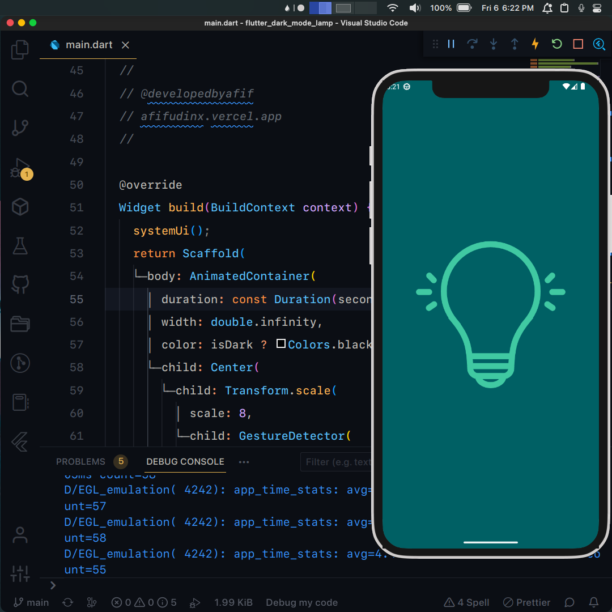

## Flutter UI - Dark Mode Lamp

```dart
void main() =>
    runApp(const MaterialApp(debugShowCheckedModeBanner: false, home: MyApp()));
```

## Development Setup
```
git clone https://github.com/afifudinx/flutter-dark-mode-lamp.git
cd flutter-dark-mode-lamp
flutter pub get
flutter run
```

## Screenshots


## Links

* [Website](https://afifudinx.vercel.app)
* [Youtube channel](https://youtube.com/developedbyafif)
* [Instagram](https://instagram.com/developedbyafif)
